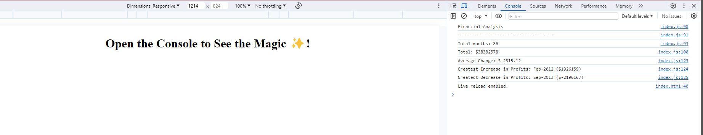

# Console-Finances
Unit 4 Challenge: Console Finances

Console-Finances
Creating code for analyzing the financial records of a company by writing JavaScript code that analyzes the records to calculate each of the following: The total number of months included in the dataset. The net total amount of Profit/Losses over the entire period. The average of the changes in Profit/Losses over the entire period.

User Story
AS an individual
I WANT to use Javascript to log changes in the console
SO THAT financial records are analysed.

Acceptance Criteria

Total number of months is included in the data set

The net total amount of Profit/Losses is recorded over the entire period

The average of the changes in Profit/Losses is recorded over the entire period

The greatest increase in profits (date and amount) is recorded over the entire period

The greatest decrease in profits (date and amount) is recorded over the entire period

//Insert a screenshot of console

